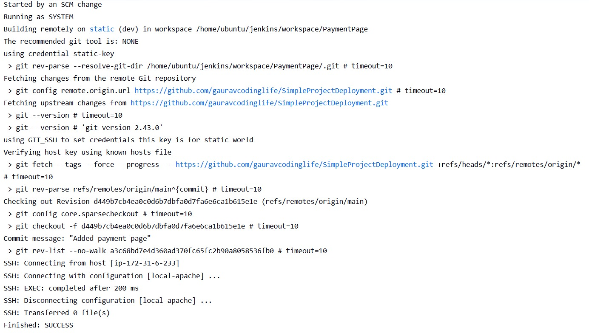
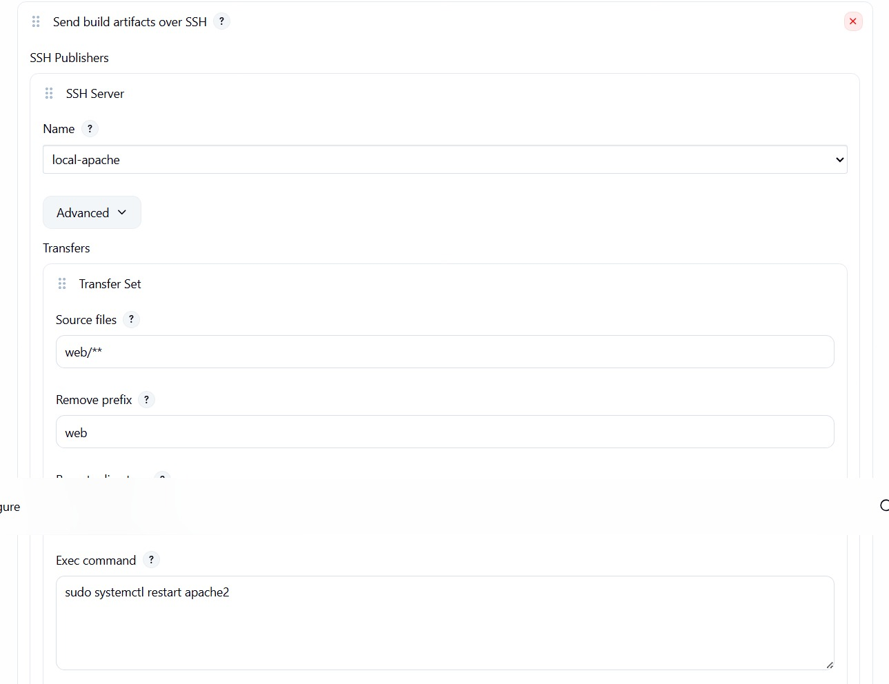

# 🚀 Automated CI/CD Pipeline for Static Web Deployment

[](https://opensource.org/licenses/MIT)
[](https://aws.amazon.com/)
[](https://www.jenkins.io/)
[](https://httpd.apache.org/)

##  Overview
This project implements a fully automated **Continuous Integration and Continuous Deployment (CI/CD)** pipeline for a static website. The infrastructure leverages **AWS EC2** for hosting, **Apache2** as the web server, and **Jenkins** for orchestration. 

This repository demonstrates **two deployment strategies**:
1. **Freestyle Job** (GUI-based, ideal for beginners)
2. **Declarative Pipeline** (Groovy-based, industry standard)

---

```markdown
---

🏗️ Architecture Diagram

```mermaid
graph TD
    A[Developer] -->|Git Push| B(GitHub Repo)
    B -->|Webhook| C[Jenkins Server]
    C -->|SSH| D[AWS EC2]
    D -->|Deploy| E["/var/www/html"]
    E -->|Serve| F[Apache2]
    F -->|HTTP| G[Users]

---


🛠️ Tech Stack

| Category | Technology |
|----------|------------|
| Cloud Provider | AWS EC2 (Ubuntu 22.04) |
| CI/CD Tool | Jenkins LTS |
| Web Server | Apache2 |
| Version Control | Git & GitHub |
| Scripting | Bash & Groovy |
| Protocol | SSH (Key-Based Authentication) |

---

📋 Prerequisites

- AWS Account with EC2 access
- Jenkins Server (Installed & Configured)
- GitHub Account
- SSH Key Pair (`.pem` file)
- Basic knowledge of Linux commands

---

 Installation & Setup

1️⃣ Infrastructure Provisioning (AWS EC2)
Launch an Ubuntu EC2 instance and configure **Security Groups**:

| Type | Port | Source |
|------|------|--------|
| SSH | 22 | Your IP |
| HTTP | 80 | 0.0.0.0/0 |
| Jenkins | 8080 | Your IP |

2️⃣ Web Server Configuration
Connect to EC2 and install Apache:

```bash
sudo apt update
sudo apt install apache2 -y
sudo systemctl start apache2
sudo systemctl enable apache2
```

### 3️⃣ Jenkins Configuration
1. Install Jenkins on your server (EC2 or local).
2. Install Plugin: `Publish Over SSH` (Required for Freestyle Method).
3. Configure SSH Server in Jenkins (Manage Jenkins → Configure System):
   - Name: `deploy-server`
   - Hostname: `<EC2_PUBLIC_IP>`
   - Username: `ubuntu`
   - Remote Directory: `/var/www/html`
   - Key: Paste private key content
4. Sudo Permissions:
   Allow Jenkins to restart Apache without a password:
   ```bash
   sudo visudo
   # Add this line at the bottom:
   jenkins ALL=(ALL) NOPASSWD: ALL
   ```

---

🔄 Deployment Methods

This project supports two ways to configure the job. Choose based on your learning goal.

✅ Option 1: Freestyle Project (GUI-Based)
Best for understanding basic Jenkins configuration.

1. Create a new Freestyle project.
2. Source Code Management: Git → Enter Repository URL.
3. Build Environment: Check `Delete workspace before build`.
4. Build Step: Select `Send files or execute commands over SSH`.
   - Source Files: `web/**`
   - Remove Prefix: `web`
   - Exec Command: `sudo systemctl restart apache2`
5. Save & Build.

---

✅ Option 2: Pipeline Project (Groovy)
Best for production readiness and "Pipeline as Code".

1. Create a new Pipeline project.
2. Select Pipeline script from SCM.
3. Ensure a `Jenkinsfile` exists in your repository root.

📄 Jenkinsfile Code
```groovy
pipeline {
    agent any

    environment {
        EC2_USER = "ubuntu"
        EC2_HOST = "<EC2_PUBLIC_IP>"
        DEPLOY_PATH = "/var/www/html"
    }

    stages {
        stage('Checkout') {
            steps {
                echo 'Pulling latest code from GitHub...'
                git branch: 'main', url: 'https://github.com/YOUR_USERNAME/YOUR_REPO.git'
            }
        }

        stage('Deploy to EC2') {
            steps {
                echo 'Deploying files to Web Server...'
                sh '''
                scp -o StrictHostKeyChecking=no -r web/* ${EC2_USER}@${EC2_HOST}:${DEPLOY_PATH}/
                ssh -o StrictHostKeyChecking=no ${EC2_USER}@${EC2_HOST} "sudo systemctl restart apache2"
                '''
            }
        }
    }

    post {
        success {
            echo 'Deployment Successful! Website is live.'
        }
        failure {
            echo 'Deployment Failed. Check console output.'
        }
    }
}
```

---

🌐 Accessing the Application

Once the build is successful, access the deployed website via:

```
http://<YOUR-EC2-PUBLIC-IP>
```

---

 Security Best Practices

- SSH Keys: Private keys are stored in Jenkins Credentials Store, never in code.
- Security Groups: Restricted access to port 22 and 8080 (Only your IP).
- Least Privilege: Jenkins user granted only necessary sudo permissions.
- No Root Login: SSH access configured for `ubuntu` user only.

---

Project Impact

- ✅ Reduced Deployment Time: From manual 10+ minutes to <1 minute.
- ✅ Error Reduction: Eliminated manual file transfer errors.
- ✅ Consistency: Ensured repeatable and reliable deployments.
- ✅ Automation: Zero manual intervention required after code commit.

---

📸 Screenshots

| Jenkins Build Success | Live Website | SSH Configuration |
|:---:|:---:|:---:|
|  |  |  |

---

🧩 Troubleshooting

| Issue | Solution |
|-------|----------|
| Permission Denied | Ensure `jenkins` user has sudo access (`visudo`) |
| SSH Connection Failed | Verify Security Group allows Port 22 from Jenkins IP |
| 403 Forbidden** | Check `/var/www/html` ownership (`www-data`) |
| Jenkins 403 Crumb Error | Logout/Login or check CSRF protection settings |

---

Learning Outcomes

- Implemented end-to-end CI/CD automation.
- Configured secure SSH key-based authentication.
- Managed Linux services (Apache) via Jenkins.
- Wrote Declarative Pipelines using Groovy.
- Deployed static web assets to cloud infrastructure.

---

👨‍💻 Author

Gaurav 
DevOps Engineer | Cloud Enthusiast*  
[](https://www.linkedin.com/in/gaurav-chavan-codinglife)
